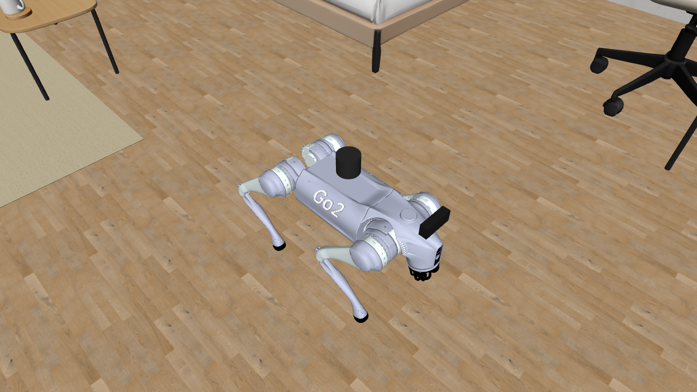

# Unitree Go2 MuJoCo for Robonix

[中文说明](README.zh-CN.md)



A standalone Go2 simulation deployment with Web MuJoCo WASM and native Python
MuJoCo backends. Both expose the same Robonix chassis, LiDAR, IMU and RGB-D
capabilities, and both support loading/unloading the included go2_rl_gym MoE
ONNX policy while running. The policy is **OFF at startup**.

Mapping, Navigation and Scene use existing Robonix services. The local Explore
adaptation uses the same contracts with connected, footprint-safe frontier goals,
failed-goal suppression, verified cancellation and request speed limits.
There is no physical Unitree transport, arm, speech, or training
dependency. Motion uses simulated joint torques; odometry comes from MuJoCo.

## Requirements

The local deployment uses Ubuntu/WSL2, Docker Compose, Node.js 20+, Python 3.10+,
uv, an installed rbnx CLI and a Robonix source checkout.
The native profile supplied here uses WSLg/X11 and NVIDIA GPU rendering.
Native physics and this small ONNX network run on CPU; RGB rendering uses GPU.
Headless mode closes the native viewer but retains RGB rendering.

Web mode needs Chromium/WebGL2. The bootstrap installs its Playwright browser.
Normal Linux machines should adapt the graphics mounts in
sim/compose.native.yaml; the checked-in native profile uses /dev/dxg and WSLg.

## Install

Run from this package directory:

```bash
cp .env.example .env
# Set ROBONIX_SOURCE_PATH, VLM_BASE_URL, VLM_API_KEY and VLM_MODEL in .env.
bash scripts/bootstrap.sh
```

Keep credentials in the ignored local .env or exported environment variables.
The simulator does not need a VLM key; Pilot and Scene use it for language/vision.
Bootstrap installs local Node dependencies, builds the simulation image, generates
primitive bindings, and builds the Robonix deployment. Runtime assets and the
pretrained policy are already included; no dataset download or policy training is
required for ordinary startup.

## Start Manually

Use three terminals. Only one simulation backend and one Robonix stack may own
the configured ROS graph and ports at a time.

Terminal 1, Web physics (default):

```bash
cd ~/robot-unitree-go2_mujoco
bash sim/start.sh --backend web --environment scenesmith_house_185
```

Native physics with its MuJoCo viewer:

```bash
bash sim/start.sh --backend native --viewer --environment scenesmith_house_185
```

Native without the viewer:

```bash
bash sim/start.sh --backend native --headless --environment scenesmith_house_185
```

Wait for the launcher to report ready. The Web viewer is
[http://127.0.0.1:5181/](http://127.0.0.1:5181/).
For native, the browser control panel is
[http://127.0.0.1:5181/?backend=native](http://127.0.0.1:5181/?backend=native);
physics and 3D rendering stay in the native process.
Bridge health is [http://127.0.0.1:8766/health](http://127.0.0.1:8766/health).
The launcher refuses occupied ports instead of stopping unrelated services.

Terminal 2, Robonix:

```bash
cd ~/robot-unitree-go2_mujoco
source scripts/env.sh
rbnx boot --no-update-check
```

Terminal 3, interaction:

```bash
cd ~/robot-unitree-go2_mujoco
source scripts/env.sh
rbnx caps -v
rbnx chat
```

Suggested requests:

- Capture the front camera and describe the room.
- Explore the rooms for 120 seconds at 0.18 m/s, and return the run ID.
- Report the exploration status, then cancel it.
- List the objects observed by Scene.
- Navigate near the closest observed table using Scene's safe approach goal.
- In `scenesmith_multilevel_house`, go upstairs, downstairs, or to floor 1/2.

Exploration is asynchronous. Finish or cancel it before starting another motion
task. Semantic navigation requires objects actually observed through RGB-D and
an occupancy map; the package does not seed Scene with simulator object positions.
Scene goal_near produces an approach pose, which Navigation executes.
A table outside the observed area cannot yet be resolved.

## Policy and Controls

The Web policy selector and `Load / Disable Policy` action live in the top-right
`Simulation > Policy` folder. Both backends acknowledge the operation and expose
errors; a reload does not reset the robot's map pose. Production mode does not
register Web motion keys or a native viewer key callback, so Robonix owns motion.

Enable local driving explicitly for development:

```bash
bash sim/start.sh --backend web --dev --environment go2_rl_stairs
bash sim/start.sh --backend native --viewer --dev --environment go2_rl_stairs
```

Development keys are W/S forward/backward, A/D yaw, Q/E lateral, Space stop,
and X reset. The native viewer also supports L to load/disable the policy.

The included policy is the existing
go2_moe_cts_high_slope_thre_164k_0.6715 from wty-yy/go2_rl_gym, not the suggested
v4.2 upgrade. It has 225 inputs (five 45-value observation frames), runs at
50 Hz over 0.002 s physics, and uses upstream joint ordering, action scale 0.25,
and PD gains 20/0.5. See
[policy provenance](assets/robots/go2/policy/moe_rough/UPSTREAM.md).

When unloaded, a deterministic gait controls the legs without neural inference.
This controller is intended for indoor flat-floor navigation; load the RL policy
to test the upstream obstacle courses. Neither controller guarantees passage
across every obstacle. Its yaw gait uses both fore-aft and lateral tangential
foot motion, and suppresses commanded motion after a large body tilt. Native
physics regression covers sustained turns in both directions, six-axis planar
commands, and velocity reversal.

For a policy-only test, Terminal 2/3 are optional:

```bash
bash sim/start.sh --backend native --viewer --dev --environment go2_rl_stairs
# Or:
bash sim/start.sh --backend web --dev --environment go2_rl_track
```

Load the policy explicitly in the UI, then issue motion commands. Unload returns
to the basic controller. Do not reset the robot while Mapping/Navigation are
active: a pose reset invalidates the current navigation run.

## Environments

| ID | Content |
| --- | --- |
| scenesmith_house_185 | New SceneSmith House: living room and bathroom (default) |
| scenesmith_house_186 | New SceneSmith House: bedroom and bathroom |
| go2_rl_stairs | Original go2_rl_gym stairs geometry |
| go2_rl_track | Original go2_rl_gym race-track geometry |
| scenesmith_multilevel_house | Two-story House 191/188 composition with a calibrated straight stair |

The two original houses are distinct single-floor multiroom dataset exports.
The added multilevel package combines House 191 and House 188 with a calibrated
stair connection. All five environments are selected through the same manifest;
the floor-transition acceptance was run on the native backend. See
[scene provenance and repeatable import](docs/scenes.md).

Stop Robonix and the simulator before changing environments, then restart both
with the new environment ID. This avoids reusing stale maps and semantic poses.

The two-floor demo uses packaged per-floor maps and a deployment-owned
`floor_transition` skill; it does not modify the system Scene, Mapping, or
Navigation services. Install the maps and start it with:

```bash
bash scripts/install-prebuilt-maps.sh
bash sim/start.sh --backend native --environment scenesmith_multilevel_house
```

See [the Chinese multi-floor demo guide](docs/MULTI_FLOOR_DEMO.zh-CN.md) for the
annotation schema, runtime state machine, scope, and manual acceptance steps.

## Floor Transition Skill

`floor_transition` is a deployment-owned, fixed-scene skill for moving Go2
between two previously mapped floors through one calibrated straight stair. It
provides asynchronous `UP`, `DOWN`, `GO_TO_FLOOR(1|2)`, `status`, and `cancel`
operations. A request for the current floor succeeds without moving the robot.

The skill does not patch the system Scene, Mapping, or Navigation services. It
resolves chassis odometry and velocity, IMU, Mapping pose/map loading, and Nav2
capabilities through Atlas. Stair geometry is owned by the environment in
[`multifloor.yaml`](assets/environments/scenesmith_multilevel_house/multifloor.yaml),
mounted read-only into the skill. Scene is not on the transition critical path
and the stair annotation is not inserted into Scene's object database.

### Supported Scope

This implementation is intended for a controlled deployment where:

- the environment is `scenesmith_multilevel_house` with exactly floors 1 and 2;
- one straight stair has manually calibrated entries, centerline, landing
  heights, direction, speed, tolerances, and timeouts;
- each floor has its own occupancy artifact and RTAB-Map localization database;
- the deterministic gait is used on flat landings and the packaged
  `moe_rough` policy has been validated on the stair geometry;
- the stair is clear of people and dynamic obstacles; and
- the requested outcome is a floor transition, not cross-floor object search.

Typical uses are a fixed-building demo, integration testing, map-switching
regression, and policy evaluation on a known stair. A new environment requires
new per-floor maps, a new annotation profile, policy validation, and full
bidirectional acceptance; copying the existing coordinates is unsafe.

### Preconditions

Before starting a transition:

1. Run the annotated scene on native MuJoCo. The closed-loop acceptance in this
   repository was performed on the native backend.
2. Install both packaged maps with `scripts/install-prebuilt-maps.sh`. Other
   users receive these maps only when `assets/maps` is included in the pushed
   repository or release artifact; the installer does not upload anything.
   The complete map IDs are `scenesmith_multilevel_floor_1_v2` (439 RTAB-Map
   nodes) and `scenesmith_multilevel_floor_2_v2` (787 nodes). The repository
   stores their databases as xz archives; the installer expands them to
   `rtabmap.db` in the runtime map directory.
3. Keep `multifloor.yaml` consistent with the scene and map coordinate frames.
4. Ensure odom, IMU, Mapping pose/load-map, Nav2 navigate/status/cancel, and the
   simulator policy bridge are healthy.
5. Ensure the robot's physical floor matches the persisted `current_floor`.
   Do not reuse state after teleporting/resetting the robot or changing scenes.
6. Stop Explore, ordinary Navigation, manual driving, and other velocity or
   policy controllers. The skill assumes exclusive motion and policy ownership.

### Runtime Sequence

Activation verifies the environment, unloads an already loaded `moe_rough`
policy, waits for odometry, and loads the persisted floor map using the actual
odom pose. A transition then:

1. uses the deterministic gait and, when needed, Nav2 to reach the annotated
   stair connection zone;
2. directly aligns to the marked entry and verifies position and heading;
3. loads `moe_rough` only for stair traversal;
4. follows the fixed centerline while checking lane error, upright attitude,
   direction, endpoint, landing height, cancellation, and timeout;
5. stops, unloads the policy, and aligns on the destination landing; and
6. loads the destination floor map in localization mode using current odometry,
   then persists the new floor only after the map load succeeds.

If the policy is already loaded before a task, it is deliberately unloaded for
the flat approach and loaded again at the stair. An unacknowledged load/unload
fails the task. Do not switch the policy concurrently from the UI or another
node.

### Mapping, Nav2, and Scene Semantics

- **Mapping:** the skill explicitly loads the immutable map for the destination
  floor in localization mode. This is not online remapping and observations are
  not written back to the packaged artifact.
- **Nav2:** stays active and receives the replacement `/map` through its static
  costmap layers. Subsequent goals must use the destination floor coordinates.
  The demo does not explicitly call `clear_costmap`; larger deployments should
  add a new-map readiness check and clear both costmaps before accepting goals.
- **Scene:** does not automatically switch a floor-specific semantic graph. The
  current skill does not support commands such as "go near an object upstairs".
  That requires floor ownership on semantic objects and floor-aware filtering or
  replacement after a successful transition.

### Exclusions and Safety Boundary

The skill does not provide unknown-stair detection, online stair geometry
estimation, spiral or multi-flight routing, multiple-connector selection,
elevators, dynamic avoidance on stairs, a single cross-floor 2D Nav2 plan,
automatic post-transition exploration, map rebuilding, cross-floor semantic
navigation, or real-hardware safety certification.

Any failed entry, heading, lane, upright, height, timeout, policy, cancellation,
or map-load check stops motion and prevents floor-state commit. The calibrated
thresholds and test evidence apply only to this MuJoCo scene.

Deterministic acceptance without Pilot/VLM is available through:

```bash
bash scripts/floor-transition.sh up
bash scripts/floor-transition.sh down
bash scripts/floor-transition.sh floor 2
bash scripts/floor-transition.sh floor 1
```

The client discovers the live MCP endpoint, prints state transitions, and waits
for a terminal result. Verify physical arrival, `current_floor`, Mapping's active
map, Nav2 health, and an unloaded policy after every run.

## Stop

```bash
source scripts/env.sh
rbnx shutdown
bash sim/stop.sh
```

Ctrl-C in each owning terminal also stops its respective lifecycle.
Simulation logs are in .runtime; Robonix logs are in rbnx-boot/logs.
These directories and local credentials are excluded from version control.

## Validation

```bash
npm test
python3 -m unittest discover -s primitives/tests
# Live ROS checks, with simulator and Robonix running:
bash scripts/acceptance.sh
# Observe autonomous exploration, then verify cancellation:
bash scripts/acceptance.sh --explore --explore-duration 150 --explore-timeout 240 --explore-speed 0.18
# Native model and sensor smoke:
docker exec mujoco_go2_sim python3 /workspace/sim/tests/native_smoke.py
```

Acceptance moves the simulated robot. Run it without competing manual or
navigation commands. Architecture details are in
[the architecture guide](docs/ARCHITECTURE.md); multi-floor results and limits
are recorded in [the demo guide](docs/MULTI_FLOOR_DEMO.zh-CN.md).

## Layout and Attribution

- assets/robots/go2: model, meshes, controller and policy.
- assets/environments: independently selectable environment packages.
- primitives: chassis, LiDAR, IMU and front camera.
- sim/native and sim/bridge: native physics and ROS2 transport.
- src: Web physics, sensors and shared operator controls.
- config, soma.yaml, urdf: navigation parameters and robot geometry.
- robonix_manifest.yaml: deployment entry point.

The integration reuses [mujoco_robonix](../mujoco_robonix) runtime patterns,
[MuJoCo-GS-Web](https://github.com/Vector-Wangel/MuJoCo-GS-Web), and the
[real Go2 Robonix deployment](https://github.com/syswonder/robot-unitree-go2).
MuJoCo model assets retain their Unitree BSD notice; the frontend foundation
retains its MIT license. SceneSmith assets and go2_rl_gym weights/courses keep
their respective upstream notices. See [NOTICE](NOTICE).
